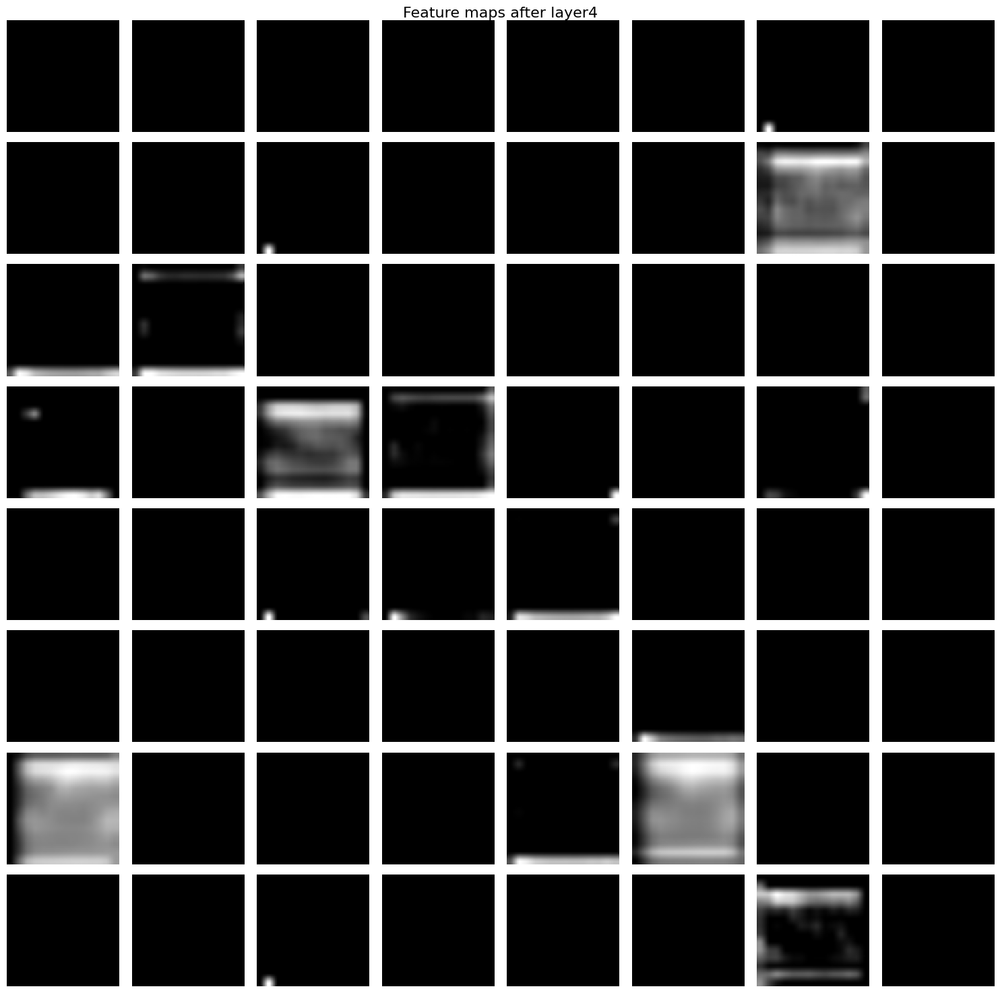

# Machine Learning 2025 - Image Classification

## project directory structure

```plaintext
.
├── data # dataset directory, each data set is generated from train data to pre, and you can rename it as you wish and pass it as an argument to the training and visualization scripts
│   ├── elastic
│   ├── pre0.1_30x1
│   ├── pre0.2x5
│   ├── pre0.3x5
│   ├── test-renamed_images
│   └── train
├── model # trained model states
│   ├── convnext_base_v1
│   ├── convnext_small_v1
│   ├── resnet101_v1
│   ├── resnet152_v1
│   ├── resnet152_v2
│   ├── resnet50_v1
│   ├── resnet50_v2
│   ├── resnext101_64x4d_v1
│   └── resnext101_64x4d_v2
├── output # prediction results
│   ├── convnext_base_v1
│   ├── convnext_small_v1
│   ├── covnext_base_v1
│   ├── resnet101_v1
│   ├── resnet50
│   ├── resnet50_v1
│   ├── resnet50_v2
│   ├── resnext101_64x4d_v1
│   ├── resnext101_64x4d_v2
│   ├── resnext_base_v1
│   └── submitted
├── __pycache__
└── visualizations
    ├── feature_maps
    └── confusion_matrix.png
``` 

## command examples

```bash
# use dataset "elastic" to train model with a pretrained model state
python3 train.py --model_choice resnext101_64x4d_v1 --model_state_path model/resnext101_64x4d_v1/2025-10-23T06-05-23_96.61423414130995.pth --dataset elastic

# predict on test data
python3 prediction.py --model_choice resnext101_64x4d_v1

# perform training data argumentation
python3 preprocess.py

# visualize feature maps and confusion matrix with a pretrained model state (hard-coded layer extractions will only work for resnet and resnext models)
python3 visualization.py --model_choice resnext101_64x4d_v1 --model_state_path model/resnext101_64x4d_v1/2025-10-23T16-19-14_98.87649722993119.pth --dataset train
```

## confusion matrix


## feature maps

### Original Image

### After 1st Convolutional Layer

### After layer 1 Residual Block

### After layer 2 Residual Block

### After layer 3 Residual Block

### After layer 4 Residual Block
